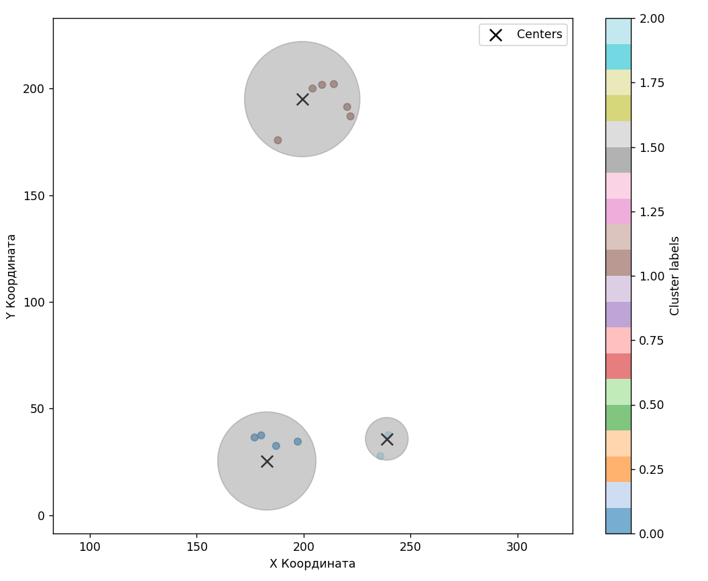
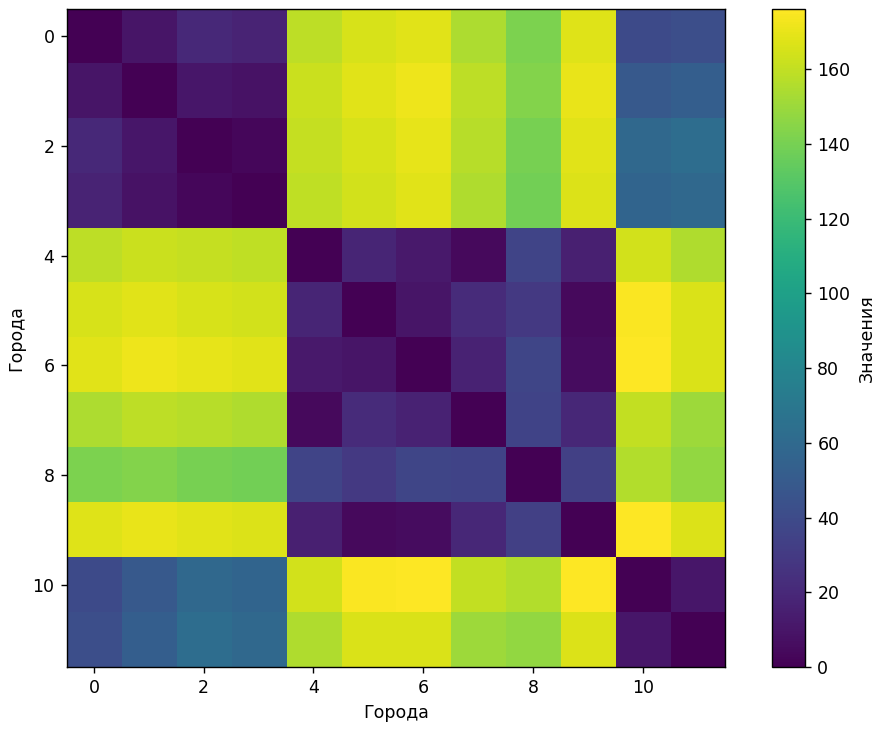

# TSP Phase Transition Library
## Overview

This library provides tools for analyzing and detecting phase transitions in NP-hard Traveling Salesman Problem (TSP) configurations, focusing on two main types of spatial distributions:
* Cluster phase transition
* Radian phase transition

## Installation
```
pip install tsp-phase-transition
```

## Quick Start
1. Cluster Phase Transition Analysis
```
from tsp_phase_transition.cluster_pt import detector as cluster_pt_detector

# Detect phase transition
is_transition = cluster_pt.detect_cluster_pt(dist_matrix)
print(f"Cluster phase transition detected: {is_transition}")
```

2. Radian Phase Transition Analysis
```
from tsp_phase_transition.radian_pt detector as radian_pt_detector

# Detect phase transition
is_transition = radian_pt.detect_radian_phase_transition(cost_matrix)
print(f"Radian phase transition detected: {is_transition}")
```

## Core Features
1. Cluster Analysis
    * generate_clusters(): Creates clustered city distributions

        Parameters:

            N: Number of cities

            k: Number of clusters

            plane_size: Area dimensions

            Customizable cluster radii and city distributions

    * detect_cluster_pt(): Identifies cluster phase transitions

        Supports multiple clustering algorithms (Agglomerative, K-Means, HDBSCAN.)

2. Radian Analysis

    * generate_pt_matrix(): Generates radial city distributions

        Parameters:

            N: Number of cities

            k: Number of radial sectors

            coef: Separation coefficient between sectors

            Customizable angular parameters

    * detect_radian_phase_transition(): Identifies radial phase transitions

        Supports multiple clustering algorithms (Agglomerative, K-Means, OPTICS.)

## Visualization Tools
```
from tsp_phase_transition.utils import vizualizer

# Show cluster visualization
vizualizer.show_clusters(coords, centers, radiuses, labels)

# Display distance matrix as heatmap
vizualizer.show_heatmap(distance_matrix)
```



## Advanced Usage
Custom Partition Generation
```
from tsp_phase_transition.partition.generator import (
    get_partitions,
    get_random_partition,
    get_most_balanced_partition,
    SortDirection
)

# Get all possible partitions
partitions = get_partitions(N=12, k=3, min_part=1)

# Generate random partition
random_part = get_random_partition(N=12, k=3, min_part=1, sort_flag=SortDirection.RAND)

# Get balanced partition
balanced_part = get_most_balanced_partition(n=12, k=3, min_part=2)
```

## Examples
See the examples.py for usage examples:
* Basic phase transition detection
* Advanced phase transition generation
* Custom visualization examples